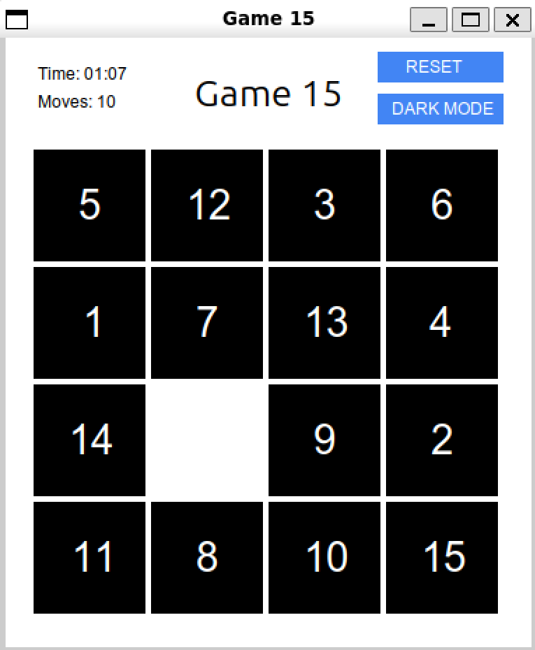

# 15 Puzzle Game using X11/Xlib



## 🎮 Game Description

The **15 Puzzle** is a classic sliding puzzle game consisting of a 4×4 grid with 15 numbered tiles and one empty space. The objective is to rearrange the tiles into numerical order by sliding them into the empty space.

### Key Features
- 🖱️ **Mouse-controlled gameplay**
- 🌓 **Dark/Light mode toggle**
- ⏱️ **Real-time timer**
- 📊 **Move counter**
- ✨ **Smooth tile animations**
- 🔄 **Reset game functionality**

## 📥 Installation
1. **Clone the repository**:
   ```bash
   git clone https://github.com/<username>/<repository>.git
   cd <repository
2. **Linux Dependencies**:
  ```bash
  sudo apt-get install libx11-dev libxft-dev gcc make
